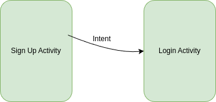

# LET ME COOK 
https://github.com/BadWolf02/LetMeCook

## 1. Overview & Purpose

### 1.1 The Problem
We often find ourselves in silly situations at home or in the supermarket getting groceries.
Assuming we know what is in the cupboard when somebody used it already, being paralysed by not knowing 
what to cook, or leaving the shopping list at home. 
We don't know exactly what we have in the cupboards if we decide to try something new when at the
supermarket and end up buying things we have or not even trying to experiment.

**Organisation** between family members can be incredibly difficult. Something that you were sure was 
at home earlier that day when you left has been used by your sister in the meantime. Next your mother
walks in, saying that she would have asked you to grab her a couple of thing if she had known you 
were going to the supermarket.

These situations are all incredibly annoying and can happen very often depending on your lifestyle. 
They just make life unnecessarily hard.

There are existing **partial** solutions that let you make shopping lists or apps that will suggest 
recipes based on specific ingredients you list or have or apps that work as cookbooks and 
allow you to search for recipes. 

However none of them seem to do all things in well in one app. Those that come close leave us with 
the problem of **coordinating** with other people living in the same household, using things without you 
knowing or wanting something from the supermarket and not knowing about it.

### 1.2 The Solution, Our App
Introducing our App: Let Me Cook. An app that allows you to browse recipes, track your household 
inventory, add things to the household shopping list and more.

We have a variety of smart features to help users plan their meal prep and shopping. We believe 
our inventory system is easier to keep track of than a traditional inventory, as we have implemented 
barcode scanning, saving time and hassle for adding items to the inventory. This makes it more 
likely that users will keep the inventory up-to-date due to the ease of use.

## 2. Architecture

### 2.1 High Level View

Figure 2.1: LetMeCook Architecture

Almost every feature of our app requires a persistent connection, or at least regular syncing with a 
3rd party service. 

#### 2.1.1 Firebase Firestore
Firebase Firestore (Firestore) is a **NoSQL document-based** database. It allows apps to store and sync data in 
real time **asynchronously**. It offered the following additional benefits:
- Offline support. Data can be accessed and modified offline and synced when online.
- Google's security guarantees.
- Large number of reads and writes for free

We used Firestore to store the majority of our data, except for sensitive user data and images. 
We used Firestore to store the following collections and fields:
- Households
  - Household name
  - Inventory
  - Invited users
  - Members
  - Shopping list
- Ingredients
  - Name
  - ID
  - Allergens
  - Calories
  - Category
  - Serving size
- Recipes
  - Name
  - Author
  - Cuisine
  - Type
  - Allergens
  - Ingredients
  - Steps
  - Average rating
  - Reviews
- Users
  - Email
  - Username
  - Household Document ID
  - Invites
  - Favourite Recipes

#### 2.1.2 Firebase Authentication
Firebase Authentication is a service that provides secure user authentication for apps. It supports multiple 
authentication methods and simplifies user management, handles **session persistence**, and integrates with 
Firebase Firestore for user-based data security. It allows easy implementation of **password restrictions** 
and allows disabling/deleting accounts from a console.

In our case we used **email authentication and verification**. Our users could remain logged in after refreshing 
the app or closing their phone. We stored the generated user ID from Authentication in Firestore as a 
user's document ID to verify user details.

#### 2.1.3 Firebase Storage
Firebase Storage is a cloud service used for storing and fetching **user-generated files**, such as images, 
videos, and documents. It allows:
- Scalable storage with Google Cloud infrastructure
- Secure file access using Firebase Authentication and Firestore Security Rules
- Efficient uploads & downloads with automatic handling of network interruptions
- Direct URL sharing for accessing stored files

We used Firebase Storage to store images for recipes, which are uploaded when a user creates 
a recipe or scrapes one from the web.

#### 2.1.4 ML Kit
**MORGAN PLEASE !!!!!!!!!!!!!!!!!**

#### 2.1.5 OpenFoodFacts
**MORGAN PLEASE !!!!!!!!!!!!!!!!!**

#### 2.1.6 BBC Good Foods
**MORGAN PLEASE !!!!!!!!!!!!!!!!!**

### 2.2 Android Architecture

#### 2.2.1 Activities and Fragments
An **Activity** is a single, focused thing in an app. Data persists while the activity is running.
A **Fragment** is a component that lives inside an Activity and depends on its lifecycle.

When switching between different activities, intents are used in order to go from one activity 
to another and pass relevant data.
This method is used to get from the sign up activity to the login activity on account creation 
as shown in the below image. 
It is used in a variety of other areas, such as the inventory in order to launch the **Barcode Scanning**
activity, in **Add Recipe** in order to handle uploading an image from the user's phone gallery,
when switching from the user fragment to viewing the invites. Recipe data is passed from the
**Home Fragment** to the **Recipe View Activity**.

//make sure to list the places this is used

We used Fragments for our primary 5 pages, navigated to via the navigation bar. These pages run 
on the **MainActivity**. This ensured smooth navigation and that the main interactable pages would have 
their data remain loaded. We used Activities to open smaller pages with a **shorter lifecycle**. 

#### 2.2.2 Model-View-ViewModel (MVVM) Architecture

Figure 2.2: MVVM Architecture

MVVM is a software design pattern commonly used in Android development to separate concerns and improve 
code organization. Its components include:
- **Model**: Represents the data layer
- **View**: Represents the UI layer
- **ViewModel**: Acts as a bridge between the two layers.

We constantly aimed to adhere to this architecture, but found fragments to be difficult to work with so we
deviated in strictly using the ViewModel in some fragments.

// add architecture overview, look up names of different architectures

### 2.3 Dependencies & Other Resources
We made use of a variety of dependencies. Many of them were built into Android and Android Studio for
our development environment. Below are some keys resources that were used to aid in the development of
our app.

#### 2.3.1 Glide
Glide is an open-source image loading library for Android. It can load images from Firebase Storage 
and efficiently caches images on retrieval.

#### 2.3.2 Google Fonts
Google provides a large variety of standardised images, symbols and logos for Android in XML format for download. 
We made use of a wide variety of these throughout our app.

### use case diagram??
### architecture of Activity and intents, drawn with eg. text underneath describing it as well as mentioning which of our other java classes use this
### Explanation of data model, mention single source of truth if we use it + control based access if I still manage to implement the authorname and the 

## 3. Main Components
The components will be broken down by page then by feature. We will highlight what happens when a
user interacts with something on screen.
We generally provide feedback to the user in the form of a Toast, which is an alert that appears with
some text. Otherwise the user will see visible change on their screen.

### 3.1 SearchDB
All methods used to retrieve data from our **Firestore database** were stored in the SearchDB class. 
The class listeners for all relevant data types and search methods which callback to the listeners. 
This file is imported in almost every other file to display data. 

### 3.2 Sign Up

Figure 3.1: Sign Up page screenshot

The Sign Up page allows users to enter a **unique** username, an email and a password which must 
follow the displayed restrictions. The Login button redirects to the Login page. The Sign Up button 
will then store the entered data and check if the details are valid.

### 3.2.1 Account Creation
When the user signs up, we first check if the fields are empty and then check if the username 
exists already. If both of these pass, we pass this data to Firebase Authentication to create an account.

Firebase Authentication checks for a valid email and password restrictions. It also checks if the email
exists in our database. The account is created in Firebase Authentication with a user ID (UID) and their
password is **hashed**. The user is then sent a verification email.

Once the account is created in Firebase Authentication, we generate and store additional account details 
in Firestore, as listed in the Firestore section. We generate a household ID and created a household
where the user is the only member.

### 3.2.2 Verification

Figure 3.2: Verification email screenshot

In the user's inbox, they will receive the following email which redirects to a blank page saying 
Verification Successful. Their account is now verified and is **eligible for login**.

### 3.3 Login

Figure 3.3: Login page screenshot

The user may enter an email and a password into the relevant fields and log in using the Login button. 
The Sign Up button redirects to the Sign Up page.

When pressing the Login button. We first check if any of the fields are empty. Firebase Authentication 
checks the email and password and checks if the email is verified. If this is successful, we create an
intent to move to the MainActivity. The UID is **persistently stored** so that it can be used to query the
database.

### 3.4 Home Page

Figure 3.4: Home page screenshot

The home page is navigated to by the navbar and is a fragment on the MainActivity. It holds the 
following features.

#### 3.4.1 Recipe List
This is a **RecyclerView** which contains an image and name of a recipe. A RecyclerView is a dynamic
list that can hold a specific xml file to create custom list items. This list by default will show
all results. If the list would go over 6 values, a Next Button appears, offering **pagination** so the
user can scroll. If there is no next page, the button disappears. A Previous Button will also appear
when scrolling, going back a page and disappearing if at the start of the list. When a list item is
pressed, it opens the RecipeViewActivity and passes over the recipe's ID.

#### 3.4.2 Recipe Filtering
There are 2 possible inputs for the user to filter in the two text boxes; **recipe name** and **author**.
The Search button will take the text in these inputs and pass them to a filterRecipe function. This
will display all results that match the combination of inputs. If there are no results, the **default 
list** will appear. The **filterRecipe** function offers additional inputs which are not currently
implemented, such as searching by cuisine. If the user presses the Reset Button, the default list
will appear.

#### 3.4.3 What Can I Cook?
The What Can I Cook button functions similarly to the Recipe Filtering. Every recipe in the database is
looped through and their ingredients are stored. The user's household inventory is fetched and checked
for each recipe ingredient. If all ingredients are present in the inventory, the recipe is added to a 
return list to be displayed. This is displayed in the Recipe List.

### 3.5 Recipe View

Figure 3.5: Recipe View page screenshot. Details, favourite, add to shopping list

Figure 3.6: Continuation of Recipe View page. Reviews.

This page is focused around the user interacting with a recipe they pressed in the Home page.

#### 3.5.1 Recipe Details
All data from the recipe is formatted and displayed to the user in a visually appealing and easy to
read way. This information is not interactable.

#### 3.5.2 Favourite Button
The Favourite Button is used to store a recipe in the user's favourite recipes which is displayed on
another page. It adds the recipe's ID to the user's Firestore document.

#### 3.5.3 Add to Shopping List Button
The Add to Shopping List Button fetches the recipe's ingredients, the user's household inventory and
the user's household shopping list. The ingredients list is looped through and if it is not present
in the inventory, it is stored in a return list. The return list is then looped through and checks
if any ingredient is in the shopping list. If it is, it is removed from the return list. The list is 
then returned, where it contains all ingredients from the recipe that are not in the inventory or on
the shopping list.

#### 3.5.4 Reviews
The user can add reviews by picking a **star rating** and writing text for the review. The Review button
submits the written review. The Reviews array in Firestore are then updated with the rating, the
comment and the username of the user. The recipe's average rating is then recalculated by checking all
current reviews, averaging them and rounding them to the nearest 0.5.

### 3.6 Chef's Corner (Recipe Creation)

Figure 3.7: Chef's Corner page screenshot. Name, meal type, ingredients, steps, cuisine, time spent cooking.

Figure 3.8: Continuation of Chef's Corner page. Cuisine, time spent cooking, time spent prepping, 
add recipe, select image, scraping.

**MEGAN PLEASE !!!!!!!!!!!!!**

### 3.7 Inventory Page

Figure 3.9: Inventory page screenshot.

**JACK PLEASE !!!!!!!!!!!!!!!!!**

#### 3.7.1 Ingredient List

Figure 3.10: Sample ingredient in Firestore database.

**JACK PLEASE !!!!!!!!!!!!!!!!!**

#### 3.7.2 Barcode Scanning

Figure 3.11: Barcode scanning a pringles can.

**MORGAN PLEASE !!!!!!!!!!!!!!!!!**

### 3.8 Shopping Page

Figure 3.12: Shopping page screenshot

The shopping list page contains a text input, a dropdown select menu and a list of all shopping list 
items along with a remove button. Items can be added by selecting from the database's list of 
ingredients in the dropdown menu, or by custom writing an item in the text input. Items added to 
the shopping list by the Add To Shopping List Button will be displayed here. Each item in the list 
is displayed with a name and a button with an X which removes the item from the list when clicked.

### 3.9 User Page

Figure 3.13: User page screenshot

The user page is the hub for all account management.

#### 3.9.1 User Details
The user's username, email and household ID are displayed for the user to see in this section. This 
information is updated if it is changed elsewhere. The user's profile picture is also displayed.

#### 3.9.2 Edit Profile

Figure 3.14: Edit Profile page screenshot

**NUTSA PLEASE !!!!!!!!!!!!!**

#### 3.9.3 Sign Out Button
On pressing the Sign Out Button, the user is signed out using Firebase Authentication and an intent 
directs them to the Login Activity.

### 3.10 Manage Household Page

Figure 3.15: Manage Household page screenshot

The HouseholdManageActivity displays all info related to the user's household. From top to bottom in 
the image above, it displays the household name, the household ID and the UID of each member of the 
household. 

The card below allows a user to invite another user to their household by inputting their username
and pressing Invite. This updates the invites array in the user's document in Firestore. Below the 
Invite button displays all the pending invites for your Household.

### 3.11 View Invites page

Figure 3.16: View Invites page screenshot

The ViewInvitesActivity displays all the invites that the user has received. Each invite is displayed
as an Accept Button, the household ID, and a Deny Button.

On pressing the Deny Button, the invite is removed from the user's invites array in Firestore and the
household's invited array. On pressing the Accept Button, the user joins the new household. This is done
by adding the user to the household's members array and removing them from the invited array, removing 
the user from the old household's members array and removing the invite from the user's invites
array. If the old household is now empty, it is **deleted**.

### 3.12 Favourite Recipes

Figure 3.17: Favourite Recipes page screenshot

The Favourite Recipes page uses the same functionality as the Recipe List without pagination. It displays
all the user's favourited recipes, which can be pressed and bring the user to the RecipeViewActivity.

## 4 Challenges &  Lessons learned
We experienced a wide variety of challenges, largely caused by interacting with **new technologies**. We have 
been lucky to be able to work with Java, a language that we are familiar with through our coursework, 
however this came with its own challenges. The Android development community no longer focuses its 
efforts on Java, but rather Kotlin.

### 4.1 Dependency clashes
**MORGAN PLEASE !!!!!!!!!!!!!!!!!**

### 4.2 Poor Firebase documentation
We found the documentation for Firebase to be incredibly poor, lacking any mention of methods that are 
used in Firebase Firestore, Firebase Authentication or Firebase Storage. We found some useful functions 
in an **open-source GitHub repo** that showcased the various uses of Firebase. We additionally had 
to read various **Firebase blogs**, written by the community, to find reference to different 
functionalities, such as callbacks.

### 4.3 Asynchronous data retrieval
One of the largest issues was creating database searching methods to be reused in our activities. 
This was done for separation of concerns but we later realised how essential it was since 
Firebase Firestore queries are asynchronous.

We had to create listener functions, using a **callback-based approach**. New listeners were created for 
different data types and use them to return the relevant data for use in other methods. 
This resulted in code being written using **lambda functions** for our callback, which was new for us.

### 4.4 Android Studio corrupting Gradle builds
Some of us ran into an issue where, on introducing a new dependency into the project, the project would
corrupt somehow. There were no resources online and ChatGPT and other AI assistants were not able 
to identify any bugs in our Gradle files. We found that the only solution was to clone the repo again.

## 5 Contribution of Team members
Our group divided up tasks at each group meeting using a **Kanban board** on the website **Trello**. We filled
the Kanban board with tasks, noting importance as some tasks required others to be complete before beginning.
We commented on tasks with ideas and ways to expand and informed each other when we finished a task and 
discussed which to take on next. This form of delegation worked incredibly well as we began development 
with no group members having previous experience with app development.

### 5.1 Joseph 122320603
Of the features listed in Main Components I created:
- Methods in SearchDB associated with other components.
- Sign Up. Account Creation & Verification
- Login
- Sign Out
- Manage Household
- View Invites
- Shopping List
- Home Page. Recipe Filtering & Recipe List
- Recipe View. Reviews & Favourites

### 5.2 Nutsa

### 5.3 Jack

### 5.4 Morgan

### 5.5 Megan
- creating first architecture overview with Morgan on a whiteboard after discussing features with the entire group
- research about architecture of Apps
- Of the features listed in the Main Components I created:
  - recipes, deciding the format of recipes
      -> responsible for saving the recipe to Db, saving details set by recipes fragment to the firestore db with document based format, 
  - adding custom recipes
      - adding recipe names, steps & dynamic creation of new step boxes as well as tracking to ensure proper saving, adding, selcetion of mealtypes, of cusine type, of time spent on dish.Selecting the image from the Galery, saving it to firestor and adding url to recips (figuring out how to allow selection of an image from the galery was done in pairprogramming with Morgan)
    - added a method to retrive allergen info and to retrive ingredients from our db in order to allow users to only select known ingredients
(I would also like to use this to point out that my group was extremly patient, when I was struggeling to understand how to properly access firebase and when I spend an entire week and barely managed to get any new features working due to just being up stuck on bugs and neede extra time on things that I thought I would get done in less time. They were all really patient and ended up taking on a few of the features I was originally going to do.)
